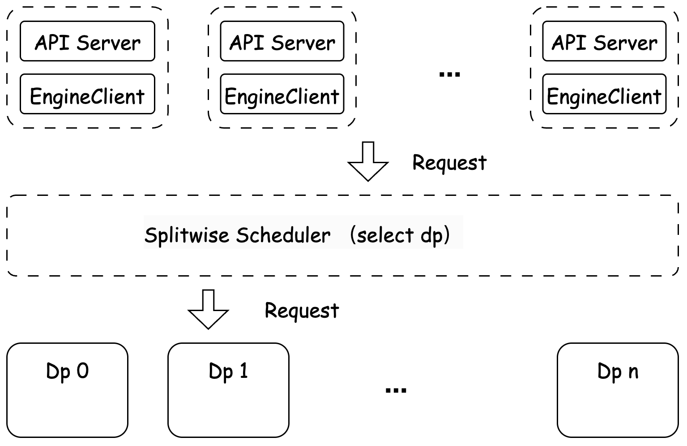
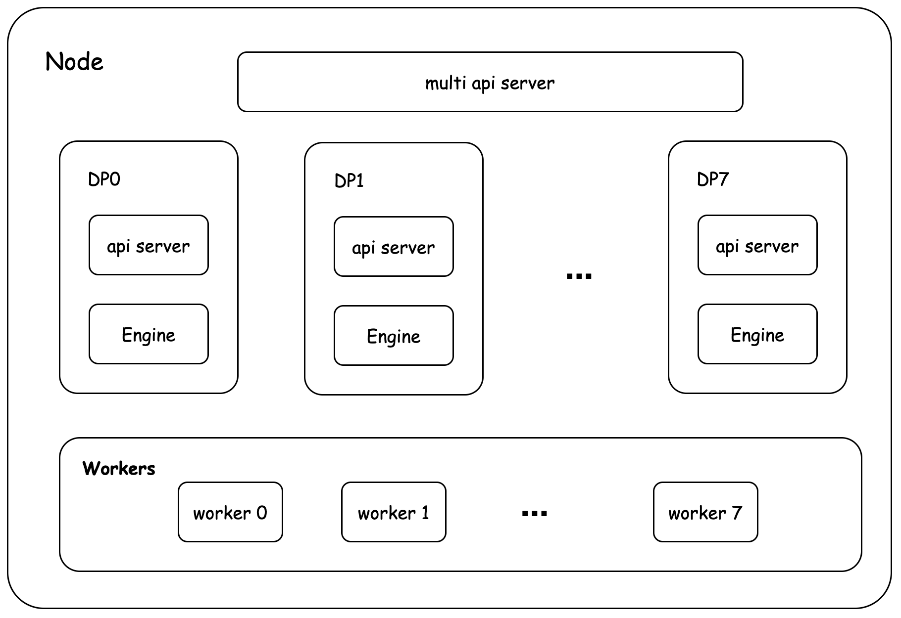

[简体中文](../zh/features/data_parallel_service.md)

# Data Parallelism
Under the MOE model, enabling Expert Parallelism (EP) combined with Data Parallelism (DP), where EP distributes expert workloads and DP enables parallel request processing.

## Data Distribution Strategy
FastDeploy uses the splitwise scheduler to monitor the load status of each DP node and distribute incoming data accordingly.

The splitwise scheduler relies on Redis to store DP load status and distribute received data.

### Expert Parallelism + Hybrid Deployment
FastDeploy provides the splitwise scheduler that monitors DP load status and schedules incoming data.
The scheduling flow is shown below - users randomly request IP and port, obtain load status via Redis, and data is distributed to less-loaded DPs for inference.


#### Offline Inference
```python
prompts = [
    "Hello, my name is",
    "你好，请问今天是星期",
    "请写6个以数字开头的成语",
    "写一个300字的小说大纲，内容是李白穿越到现代，最后成为公司文职人员的故事",
    "我要采访一位科幻作家，创建一个包含5个问题的列表"
]

sampling_params = SamplingParams(temperature=0.8, top_p=0.95, max_tokens=128)

llm = LLM(
    model="ERNIE-4_5-300B-A47B-FP8-Paddle",
    tensor_parallel_size=1,
    data_parallel_size=8,
    max_model_len=8192,
    num_gpu_blocks_override=1024,
    engine_worker_queue_port="6077,6078,6079,6080,6081,6082,6083,6084",
    enable_expert_parallel=True,
    scheduler_name="splitwise",
    scheduler_host="127.0.0.1",
    scheduler_topic="test",
    scheduler_port=6379
)
outputs = llm.generate(prompts, sampling_params)

for output in outputs:
    prompt = output.prompt
    generated_text = output.outputs.text
    print("generated_text: ", generated_text)
    print("\n")
```

#### Online Inference
```shell
python -m fastdeploy.entrypoints.openai.api_server \
       --model ERNIE-4_5-300B-A47B-FP8-Paddle \
       --port 8184 --metrics-port 8185 \
       --engine-worker-queue-port "6077,6078,6079,6080,6081,6082,6083,6084"  \
       --data-parallel-size 8 --tensor-parallel-size 1\
       --enable-expert-parallel \
       --scheduler-name "splitwise" \
       --scheduler-host "127.0.0.1" \
       --scheduler-port 6379 \
       --scheduler-topic "test" \
       --scheduler-ttl 9000
```

### User-Managed Scheduling
FastDeploy provides multi_api_server, allowing users to launch multiple API servers and manually select DPs for requests. In this case, users can add their own load balancing models for scheduling. (Currently only supports online inference)

#### Online Inference


```shell
export FD_ENABLE_MULTI_API_SERVER=1
python -m fastdeploy.entrypoints.openai.multi_api_server \
  --ports "1811,1822,1833,1844,1855,1866,1877,1888" \
  --num-servers 8 \
  --metrics-ports "3101,3201,3301,3401,3501,3601,3701,3801" \
  --args --model ERNIE-4_5-300B-A47B-FP8-Paddle \
  --engine-worker-queue-port "25611,25621,25631,25641,25651,25661,25671,25681" \
  --tensor-parallel-size 1 \
  --data-parallel-size 8 \
  --max-model-len 12288 \
  --max-num-seqs 64 \
  --num-gpu-blocks-override 256 \
  --enable-expert-parallel
```

### Parameter Description
- num-servers: Number of API servers to launch
- ports: Ports for API servers
- args: Arguments for API servers

### Data Parallelism + Disaggregated Deployment
Refer to [Disaggregated Deployment](disaggregated.md#multi-machine-disaggregated-deployment)

#### Online Inference
For multi-machine deployment, ensure network cards support RDMA and all cluster nodes are interconnected.

**Note**:
- `KVCACHE_RDMA_NICS` specifies RDMA network cards for the current machine, multiple cards should be separated by commas.
- The repository provides an automatic RDMA network card detection script `bash scripts/get_rdma_nics.sh <device>`, where <device> can be `cpu` or `gpu`.

**Prefill Instance**
```bash
export FD_LOG_DIR="log_prefill"
export CUDA_VISIBLE_DEVICES=0,1,2,3,4,5,6,7
echo "set RDMA NICS"
export $(bash scripts/get_rdma_nics.sh gpu)
echo "KVCACHE_RDMA_NICS ${KVCACHE_RDMA_NICS}"
python -m fastdeploy.entrypoints.openai.api_server \
       --model ERNIE-4_5-300B-A47B-FP8-Paddle \
       --port 8180 --metrics-port 8181 \
       --engine-worker-queue-port "25611,25621,25631,25641,25651,25661,25671,25681" \
       --cache-queue-port 8183 \
       --tensor-parallel-size 1 \
       --data-parallel-size 4 \
       --enable-expert-parallel \
       --cache-transfer-protocol "rdma,ipc" \
       --rdma-comm-ports "7671,7672,7673,7674,7675,7676,7677,7678" \
       --pd-comm-port "2334" \
       --splitwise-role "prefill" \
       --scheduler-name "splitwise" \
       --scheduler-host "127.0.0.1" \
       --scheduler-port 6379 \
       --scheduler-topic "test" \
       --scheduler-ttl 9000
```

**Decode Instance**
```bash
export FD_LOG_DIR="log_decode"
export CUDA_VISIBLE_DEVICES=0,1,2,3,4,5,6,7
echo "set RDMA NICS"
export $(bash scripts/get_rdma_nics.sh gpu)
echo "KVCACHE_RDMA_NICS ${KVCACHE_RDMA_NICS}"
python -m fastdeploy.entrypoints.openai.api_server \
       --model ERNIE-4_5-300B-A47B-FP8-Paddle \
       --port 8184 --metrics-port 8185 \
       --engine-worker-queue-port "25611,25621,25631,25641,25651,25661,25671,25681" \
       --cache-queue-port 8187 \
       --tensor-parallel-size 1 \
       --data-parallel-size 4 \
       --enable-expert-parallel \
       --scheduler-name "splitwise" \
       --cache-transfer-protocol "rdma,ipc" \
       --rdma-comm-ports "7671,7672,7673,7674,7675,7676,7677,7678" \
       --pd-comm-port "2334" \
       --scheduler-host "127.0.0.1" \
       --scheduler-port 6379 \
       --scheduler-ttl 9000
       --scheduler-topic "test" \
       --splitwise-role "decode"
```
