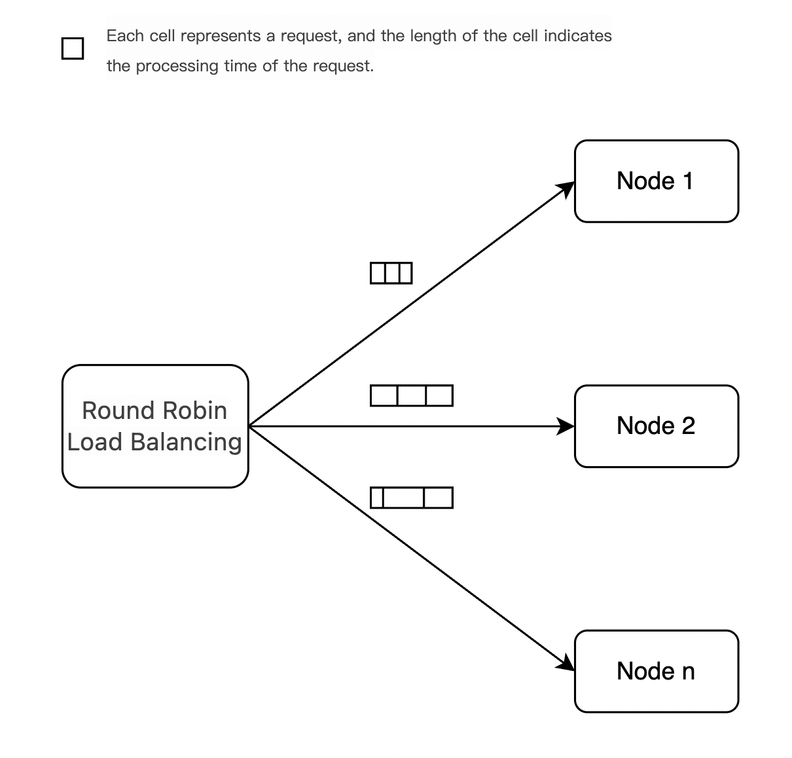

[简体中文](../zh/features/load_balance.md)

# Global Scheduler: Multi-Instance Load Balancing

## Design Overview
Cluster nodes autonomously pull tasks from other nodes during idle periods based on real-time workload, then push execution results back to the originating node.

### What Problem Does the Global Scheduler Solve?


Standard load balancing distributes requests using round-robin strategy, ensuring equal request counts per inference instance.

In LLM scenarios, request processing time varies significantly based on input/output token counts. Even with equal request distribution, inference completion times differ substantially across instances.

The global scheduler solves this imbalance through cluster-level optimization.

## How the Global Scheduler Works


As shown:
* Nodes 1, 2, and n each receive 3 requests
* At time T:
  * Node 1 completes all tasks
  * Nodes 2 and n process their second requests (1 request remaining each)
* Node 1 steals a task from Node 2, processes it, and pushes results to Node 2’s response queue

This secondary load balancing strategy will
✅ Maximizes cluster resource utilization
✅ Reduces Time-To-First-Token (TTFT)

# How to use Global Scheduler

## Prerequisite: Redis Setup

### conda installation

```bash
conda install redis
# Launch
nohup redis-server > redis.log 2>&1 &
```

### apt installation (Debian/Ubuntu)

```bash
# Install
sudo apt install redis-server -y
# Launch
sudo systemctl start redis-server
```

### yum installation (RHEL/CentOS)

```bash
# Install
sudo yum install redis -y
# Launch
sudo systemctl start redis
```

## Launching FastDeploy

```bash
python -m fastdeploy.entrypoints.openai.api_server \
       --port 8801 \
       --metrics-port 8802 \
       --engine-worker-queue-port 8803 \
       --model baidu/ERNIE-4.5-0.3B-Paddle \
       --scheduler-name global \
       --scheduler-ttl 900 \
       --scheduler-host "127.0.0.1" \
       --scheduler-port 6379 \
       --scheduler-db 0 \
       --scheduler-password "" \
       --scheduler-topic "default" \
       --scheduler-min-load-score 3 \
       --scheduler-load-shards-num 1
```

[Scheduler Launching Parameter](../online_serving/scheduler.md)

### Deployment notes:

1. Execute this command on multiple machines to create inference instances
2. For single-machine multi-instance deployments: ensure port uniqueness
3. Use Nginx for external load balancing alongside the global scheduler’s internal balancing
