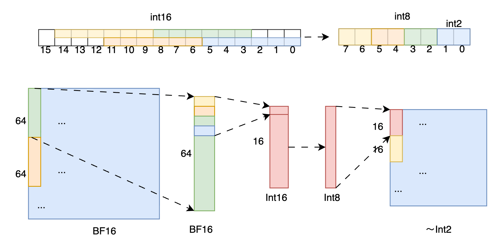

[简体中文](../zh/quantization/wint2.md)

# WINT2 Quantization

Weights are compressed offline using the [CCQ (Convolutional Coding Quantization)](https://arxiv.org/pdf/2507.07145) method. The actual stored numerical type of weights is INT8, with 4 weights packed into each INT8 value, equivalent to 2 bits per weight. Activations are not quantized. During inference, weights are dequantized and decoded in real-time to BF16 numerical type, and calculations are performed using BF16 numerical type.
- **Supported Hardware**: GPU
- **Supported Architecture**: MoE architecture
This method relies on the convolution algorithm to use overlapping bits to map 2-bit values ​​to a larger numerical representation space, so that the model weight quantization retains more information of the original data while compressing the true value to an extremely low 2-bit size. The general principle can be seen in the figure below:


CCQ WINT2 is generally used in resource-constrained and low-threshold scenarios. Taking ERNIE-4.5-300B-A47B as an example, weights are compressed to 89GB, supporting single-card deployment on 141GB H20.

## Executing WINT2 Offline Inference
- When executing TP2/TP4 models, you can change the `model_name_or_path` and `tensor_parallel_size` parameters.
```
model_name_or_path = "baidu/ERNIE-4.5-300B-A47B-2Bits-Paddle"
prompts = ["解析三首李白的诗"]
from fastdeploy import LLM, SamplingParams
sampling_params = SamplingParams(temperature=0.7, top_p=0, max_tokens=128)
llm = LLM(model=model_name_or_path, tensor_parallel_size=1, use_cudagraph=True,)
outputs = llm.generate(prompts, sampling_params)
print(outputs)

```

## Run WINT2 Inference Service
- When executing TP2/TP4 models, you can change the `--model` and `tensor-parallel-size` parameters.
```
python -m fastdeploy.entrypoints.openai.api_server \
    --model baidu/ERNIE-4.5-300B-A47B-2Bits-Paddle \
    --port 8180 \
    --metrics-port 8181 \
    --engine-worker-queue-port 8182 \
    --cache-queue-port 8183 \
    --tensor-parallel-size 1 \
    --max-model-len  32768 \
    --use-cudagraph \
    --enable-prefix-caching \
    --enable-chunked-prefill \
    --max-num-seqs 256
```

## Request the Service
After starting the service, the following output indicates successful initialization:

```shell
api_server.py[line:91] Launching metrics service at http://0.0.0.0:8181/metrics
api_server.py[line:94] Launching chat completion service at http://0.0.0.0:8180/v1/chat/completions
api_server.py[line:97] Launching completion service at http://0.0.0.0:8180/v1/completions
INFO:     Started server process [13909]
INFO:     Waiting for application startup.
INFO:     Application startup complete.
INFO:     Uvicorn running on http://0.0.0.0:8180 (Press CTRL+C to quit)
```

### Health Check

Verify service status (HTTP 200 indicates success):

```shell
curl -i http://0.0.0.0:8180/health
```

### cURL Request

Send requests to the service with the following command:

```shell
curl -X POST "http://0.0.0.0:1822/v1/chat/completions" \
-H "Content-Type: application/json" \
-d '{
  "messages": [
    {"role": "user", "content": "Write me a poem about large language model."}
  ],
  "stream": true
}'
```

### Python Client (OpenAI-compatible API)

FastDeploy's API is OpenAI-compatible. You can also use Python for requests:

```python
import openai
host = "0.0.0.0"
port = "8180"
client = openai.Client(base_url=f"http://{host}:{port}/v1", api_key="null")

response = client.chat.completions.create(
    model="null",
    messages=[
        {"role": "system", "content": "I'm a helpful AI assistant."},
        {"role": "user", "content": "Write me a poem about large language model."},
    ],
    stream=True,
)
for chunk in response:
    if chunk.choices[0].delta:
        print(chunk.choices[0].delta.content, end='')
print('\n')
```

By specifying `--model baidu/ERNIE-4.5-300B-A47B-2Bits-Paddle`, the offline quantized WINT2 model can be automatically downloaded from AIStudio. In the config.json file of this model, there will be WINT2 quantization-related configuration information, so there's no need to set `--quantization` when starting the inference service.

Example of quantization configuration in the model's config.json file:

```
"quantization_config": {
    "dense_quant_type": "wint8",
    "moe_quant_type": "w4w2",
    "quantization": "wint2",
    "moe_quant_config": {
    "moe_w4_quant_config": {
        "quant_type": "wint4",
        "quant_granularity": "per_channel",
        "quant_start_layer": 0,
        "quant_end_layer": 6
    },
    "moe_w2_quant_config": {
        "quant_type": "wint2",
        "quant_granularity": "pp_acc",
        "quant_group_size": 64,
        "quant_start_layer": 7,
        "quant_end_layer": 53
    }
  }
}
```

- For more deployment tutorials, please refer to [get_started](../get_started/ernie-4.5.md);
- For more model descriptions, please refer to [Supported Model List](../supported_models.md).

## WINT2 Performance

On the ERNIE-4.5-300B-A47B model, comparison of WINT2 vs WINT4 performance:

| Test Set | Dataset Size | WINT4 | WINT2 |
|---------|---------|---------|---------|
| IFEval |500|88.17 | 85.95 |
|BBH|6511|94.43|90.06|
|DROP|9536|91.17|89.32|
|CMMLU|11477|89.92|86.55|
