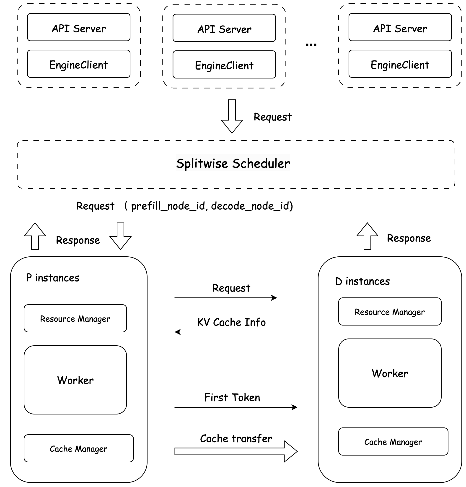

[English](../../features/disaggregated.md)

# 分离式部署

大模型推理分为两个部分Prefill和Decode阶段，分别为计算密集型（Prefill）和存储密集型（Decode）两部分。将Prefill 和 Decode 分开部署在一定场景下可以提高硬件利用率，有效提高吞吐，降低整句时延，

* Prefill阶段：处理输入的全部Token（如用户输入的Prompt），完成模型的前向传播（Forward），生成首token。
* Decode阶段：从生成第首token后，采用自回归一次生成一个token，直到生成到stop token结束；设输出N✖️token，Decode阶段需要执行（N-1）次前向传播，只能串行执行，并且在生成过程中，需要关注的token数越来越多，计算量也逐渐增大。

分离式部署核心是将Prefill 和 Decode 部署在不同的计算资源上，提高各自的利用率。要想实现分离式部署，不可避免的需要考虑Prefill 和 Decode 之间的通信问题。
在实际推理过程中Prefill 需要将其计算得到的KV Cache 传输至Decode 实例，Decode 读取KV Cache 进行续推。

## KV Cache 传输方式
针对KV Cache 传输我们提供了2种传输方式，分别针对单机内与多机间的场景。

### 单机内传输
通过cudaMemcpyPeer进行单机内两个GPU之间KV Cache传输，时延低且吞吐高

### 多机间传输
针对多机之间的传输，通过高速网络RDMA传输KV Cache。 针对RDMA传输我们提供了高速传输的网络库`rdma_comm` 实现跨机的KV Cache传输。

## PD 分离调度

在全局调度器的基础上，FastDeploy 支持 PD 分离调度策略，专为大语言模型推理场景设计，将推理流程中的两个阶段解耦：
* Prefill 阶段：构建 KV 缓存，计算密集，显存占用高但延迟低；
* Decode 阶段：进行自回归解码，过程串行、耗时长但显存占用低。

多实例情况下，每收到一条请求需要根据不同的策略将请求分配到不同的Prefill实例和Decode实例。通过角色分离（prefill 节点负责接收并处理请求，decode节点完成后续生成），可以更细粒度地控制资源分配、提高吞吐量与 GPU 利用率。

## 使用说明

### 多机分离式部署

#### 前置依赖 Redis
* 使用`conda`安装

> **⚠️ 注意**
> **Redis 版本要求：6.2.0 及以上**
> 低于此版本可能不支持所需的命令。

```bash
# 安装
conda install redis
# 启动
nohup redis-server > redis.log 2>&1 &
```

* 使用`apt`安装

```bash
# 安装
sudo apt install redis-server -y
# 启动
sudo systemctl start redis-server
```

* 使用`yum`安装

```bash
# 安装
sudo yum install redis -y
# 启动
sudo systemctl start redis
```

#### 在线推理服务

多机部署时需要确认当前网卡是否支持RDMA，并且需要集群中所有节点网络互通。

**注意**：
* `KVCACHE_RDMA_NICS` 指定当前机器的RDMA网卡，多个网卡用逗号隔开。
* 仓库中提供了自动检测RDMA网卡的脚本 `bash scripts/get_rdma_nics.sh <device>`, 其中 <device> 可以是 `cpu` 或 `gpu`。

**prefill 实例**

```bash

export FD_LOG_DIR="log_prefill"
export CUDA_VISIBLE_DEVICES=0,1,2,3
export ENABLE_V1_KVCACHE_SCHEDULER=0
echo "set RDMA NICS"
export $(bash scripts/get_rdma_nics.sh gpu)
echo "KVCACHE_RDMA_NICS ${KVCACHE_RDMA_NICS}"
python -m fastdeploy.entrypoints.openai.api_server \
       --model ERNIE-4.5-300B-A47B-BF16 \
       --port 8180 --metrics-port 8181 \
       --engine-worker-queue-port 8182 \
       --cache-queue-port 8183 \
       --tensor-parallel-size 4 \
       --quantization wint4 \
       --cache-transfer-protocol "rdma,ipc" \
       --rdma-comm-ports "7671,7672,7673,7674" \
       --pd-comm-port "2334" \
       --splitwise-role "prefill" \
       --scheduler-name "splitwise" \
       --scheduler-host "127.0.0.1" \
       --scheduler-port 6379 \
       --scheduler-topic "test" \
       --scheduler-ttl 9000
```

**decode 实例**

```bash
export FD_LOG_DIR="log_decode"
export CUDA_VISIBLE_DEVICES=4,5,6,7
export ENABLE_V1_KVCACHE_SCHEDULER=0
echo "set RDMA NICS"
export $(bash scripts/get_rdma_nics.sh gpu)
echo "KVCACHE_RDMA_NICS ${KVCACHE_RDMA_NICS}"
python -m fastdeploy.entrypoints.openai.api_server \
       --model ERNIE-4.5-300B-A47B-BF16 \
       --port 8184 --metrics-port 8185 \
       --engine-worker-queue-port 8186 \
       --cache-queue-port 8187 \
       --tensor-parallel-size 4 \
       --quantization wint4 \
       --scheduler-name "splitwise" \
       --cache-transfer-protocol "rdma,ipc" \
       --rdma-comm-ports "7671,7672,7673,7674" \
       --pd-comm-port "2334" \
       --scheduler-host "127.0.0.1" \
       --scheduler-port 6379 \
       --scheduler-ttl 9000
       --scheduler-topic "test" \
       --splitwise-role "decode"
```

### 参数说明

* --splitwise-role: 指定当前服务为prefill还是decode
* --cache-queue-port: 指定cache服务的端口，用于prefill和decode服务通信

#### 单机参数说明

* --inner-prefill-ports: 仅需Decode实例填写，指定需要连接的prefill实例的端口列表

#### 多机参数说明
* --cache-transfer-protocol: 指定KV Cache传输协议，支持ipc和rdma，默认ipc
* --scheduler-name: PD分离情况下为splitwise
* --scheduler-host: 连接的redis地址
* --scheduler-port: 连接的redis端口
* --scheduler-ttl: 指定redis的ttl时间，单位为秒
* --scheduler-topic: 指定redis的topic
* --pd-comm-port: 指定pd通信的端口
* --rdma-comm-ports: 指定RDMA通信的端口，多个端口用逗号隔开，数量与卡数一致
