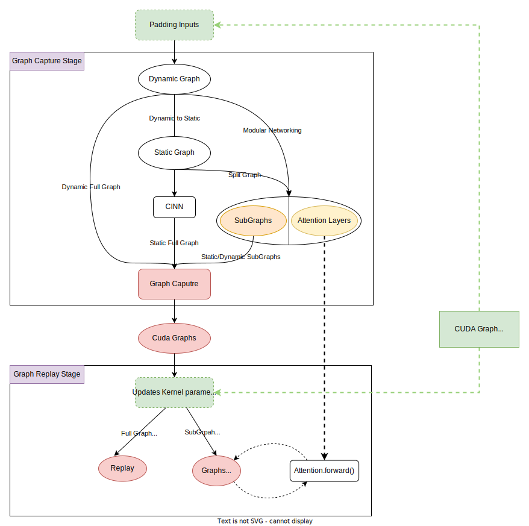

[English](../../features/graph_optimization.md)

# FastDeploy 中的图优化技术
FastDeploy 的 `GraphOptimizationBackend` 中集成了多种图优化技术:

+ **CUDA Graph**：一种通过单个 CPU 操作启动多个 GPU 操作的机制，可以降低开销并提高性能

+ **动态图转静态图**：将动态图转换为静态图，利用全局图结构信息优化计算图、提升执行效率

+ **CINN 神经网络编译器**：在静态图的基础上执行 IR 转换、Kernel 融合、Kernel 生成等计算图编译优化方法，实现综合优化

任何依赖数据的控制流、Host-Device 同步、地址/形状变化的模型输入、动态的 Kernel 执行配置等动态情况都会导致 CUDAGraph Capture/Replay 失败，而大模型推理中面临场景的是动态的输入长度、动态的 Batch Size，灵活的 Attention 实现和多卡通信，导致 CUDA Graph 难以应用。

开源主流方案基于静态图实现 CUDA Graph，技术栈较深。FastDeploy 不仅支持静态图、神经网络编译器、CUDAGraph 组合优化，还支持直接在动态图中应用 CUDA Graph ，开发成本更低，但面临的动态情况更复杂。

FastDeploy 的 `GraphOptimizationBackend` 设计架构如下，**部分功能仍在开发中，建议仔细阅读第一章节使用限制**。



## 1. GraphOptimizationBackend 当前使用限制
### 1.1 多卡场景需要开启 Custom all-reduce
在 CUDAGraph 多卡推理任务中需要使用 Custom all-reduce 算子进行多卡 all-reduce。

2.3 版本之前，CUDAGraph 和 Custom all-reduce 都未默认开启，2.3 版本开始已默认开启。

### 1.2 FLAGS_max_partition_size 相关的 Kernel 的动态执行配置导致 CUDAGraph 执行失败
`FLAGS_max_partition_size` 环境变量控制了 CascadeAppend Attention 中 Kernel 的`gridDim` 执行配置 , 而动态的执行配置会导致 CUDAGraph 执行失败。

[PR#3223](https://github.com/PaddlePaddle/FastDeploy/pull/3223) 修复了这个问题，但在 2.2 之前的 Release 版本依然存在这个问题。

**问题自查方法：**
+ 根据`FLAGS_max_partition_size`的值（默认是 32K）和启动参数中的 `max_model_len`计算`div_up(max_model_len, max_partition_size)`，结果大于`1`时无法执行，等于`1`时可以正常运行

**解决方法：**
  1. 调整`FLAGS_max_partition_size`和`max_model_len`的值，不触发动态执行配置。
  2. 关闭 CUDAGraph

## 2. GraphOptimizationBackend 相关配置参数说明

当前仅支持用户配置以下参数：

+ `graph-optimization-config` :  Dict[str, Any]
  + `graph_opt_level`: int = 0
  + `use_cudagraph`: bool = True
  + `cudagraph_capture_sizes` : List[int]

在2.3版本之前需要通过`--use-cudagraph`启用。2.3版本开始 CUDAGraph 已经默认开启，对于暂时不能兼容 CUDAGraph 的功能（投机解码、多模模型推理）CUDAGraph 会自动关闭。也可以通过设置 `--graph-optimization-config` 手动控制 CUDAGraph。

`--graph-optimization-config` 中的 `graph_opt_level` 参数用于配置图优化等级，可选项如下：

+ `0`: 动态图，默认为 0
+ `1`: 静态图，初始化阶段会使用 Paddle API 将动态图转换为静态图
+ `2`: 在静态图的基础上，使用 Paddle 框架编译器（CINN, Compiler Infrastructure for Neural Networks）进行编译优化

一般情况下静态图比动态图的 Kernel Launch 开销更小，推荐使用静态图。
对于已适配的模型，FastDeploy 的 CudaGraph **可同时支持动态图与静态图**。

在默认配置下开启 CudaGraph 时，会根据 `max_num_seqs` 参数自动设置 CudaGraph 需要捕获的 Batch Size 列表，需要捕获的 Batch Size 的列表自动生成逻辑如下：

1. 生成一个范围为 [1,1024] Batch Size 的候选列表

```
        # Batch Size [1, 2, 4, 8, 16, ... 120, 128]
        candidate_capture_sizes = [1, 2, 4] + [8 * i for i in range(1, 17)]
        # Batch Size (128, 144, ... 240, 256]
        candidate_capture_sizes += [16 * i for i in range(9, 17)]
        # Batch Size (256, 288, ... 992, 1024]
        candidate_capture_sizes += [32 * i for i in range(17, 33)]
```

2. 根据用户设置的 `max_num_seqs` 裁剪候选列表，得到范围为 [1, `max_num_seqs`] 的 CudaGraph 捕获列表。

用户也可以通过 `--graph-optimization-config` 中的 `cudagraph_capture_sizes` 参数自定义需要被 CudaGraph 捕获的 Batch Size 列表:

```
--graph-optimization-config '{"cudagraph_capture_sizes": [1, 3, 5, 7, 9]}'
```

### 2.1 CudaGraph相关参数说明

使用 CudaGraph 会产生一些额外的显存开销，在FastDeploy中分为下面两类：

+ 额外的输入 Buffer 开销
+ CudaGraph 使用了专用的显存池，因此会持有一部分与主框架隔离的中间激活显存

FastDeploy 的初始化顺序为先使用 `gpu_memory_utilization` 参数计算 `KVCache` 可用的显存，初始化完 `KVCache` 之后才会使用剩余显存初始化 CudaGraph。由于 CudaGraph 目前还不是默认开启的，因此使用默认启动参数可能会遇到 `Out Of Memory` 错误，可以尝试使用下面三种方式解决：

+ 调低 `gpu_memory_utilization` 的值，多预留一些显存给CudaGraph使用。
+ 调低 `max_num_seqs` 的值，降低最大并发数。
+ 通过 `graph_optimization_config` 自定义需要 CudaGraph 捕获的 Batch Size 列表 `cudagraph_capture_sizes`，减少捕获的图的数量

使用CudaGraph之前，需要确保加载的模型被装饰器 ``@support_graph_optimization``正确修饰。

```python
  # 1. import 装饰器
  from fastdeploy.model_executor.graph_optimization.decorator import support_graph_optimization
  ...

  # 2. 添加装饰器
  @support_graph_optimization
  class Ernie4_5_Model(nn.Layer): # 注意 decorator 加在 nn.Layer 的子类上
      ...

  # 3. 修改 ModelForCasualLM 子类中 self.model() 的传参方式
   class Ernie4_5_MoeForCausalLM(ModelForCasualLM):
      ...
      def forward(
          self,
          ids_remove_padding: paddle.Tensor,
          forward_meta: ForwardMeta,
      ):
          hidden_states = self.model(ids_remove_padding=ids_remove_padding, # 传参时指定参数名
                                     forward_meta=forward_meta)
          return hidden_statesfrom fastdeploy.model_executor.graph_optimization.decorator import support_graph_optimization
  ...

  @support_graph_optimization
  class Ernie45TModel(nn.Layer): # 注意 decorator 加在 nn.Layer 的子类上
      ...
```
