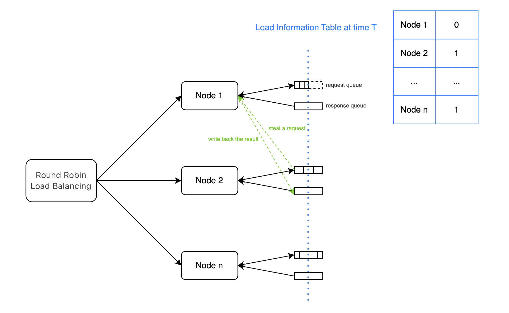

[English](../../features/load_balance.md)

# 全局调度器: 多实例负载均衡

## 设计方案
集群中的各个节点根据自身负载情况，空闲时主动从其他节点偷取任务，然后将任务的执行结果推送回原节点。

### 全局调度器解决了什么问题？


在常规负载均衡策略中，集群按照轮询策略分发请求，可以确保每个推理实例接受到的请求个数是均匀的。

在LLM场景中，每个请求的处理时间和请求各自的输入输出token数有关。即使请求均匀的分发到每个推理实例上，每个推理实例完成推理的时间也会相差很大。

所以，我们希望通过全局调度器进一步优化集群负载。

### 全局调度器是如何工作的？


如上图所示，节点1,2,n均收到了3个请求。在T时刻，节点1已经完成了对所有请求的处理，节点2和节点n正在处理第二个请求（各自的请求队列中还剩余1个请求）。此时，节点1窃取到了节点2的一个请求进行处理，并将结果推送回节点2的响应队列中。

全局调度器在集群内完成二次负载均衡，可以有效提高集群整体资源利用率，降低TTFT(Time To First Token)。

## 如何使用全局调度器

### 前置依赖 Redis
- 使用`conda`安装

```bash
# 安装
conda install redis
# 启动
nohup redis-server > redis.log 2>&1 &
```

- 使用`apt`安装

```bash
# 安装
sudo apt install redis-server -y
# 启动
sudo systemctl start redis-server
```

- 使用`yum`安装

```bash
# 安装
sudo yum install redis -y
# 启动
sudo systemctl start redis
```

### 启动FastDeploy

```bash
python -m fastdeploy.entrypoints.openai.api_server \
       --port 8801 \
       --metrics-port 8802 \
       --engine-worker-queue-port 8803 \
       --model baidu/ERNIE-4.5-0.3B-Paddle \
       --scheduler-name global \
       --scheduler-ttl 900 \
       --scheduler-host "127.0.0.1" \
       --scheduler-port 6379 \
       --scheduler-db 0 \
       --scheduler-password "" \
       --scheduler-topic "default" \
       --scheduler-min-load-score 3 \
       --scheduler-load-shards-num 1
```

[启动参数说明](../online_serving/scheduler.md)

可以将上述启动命令在多个机器执行，启动多个推理实例（如果是在一个机器中启动多个推理实例，注意端口不要冲突）。

集群外部的负载均衡可以使用`Nginx`进行搭建，集群内部的负载均衡由全局调度器负责。
