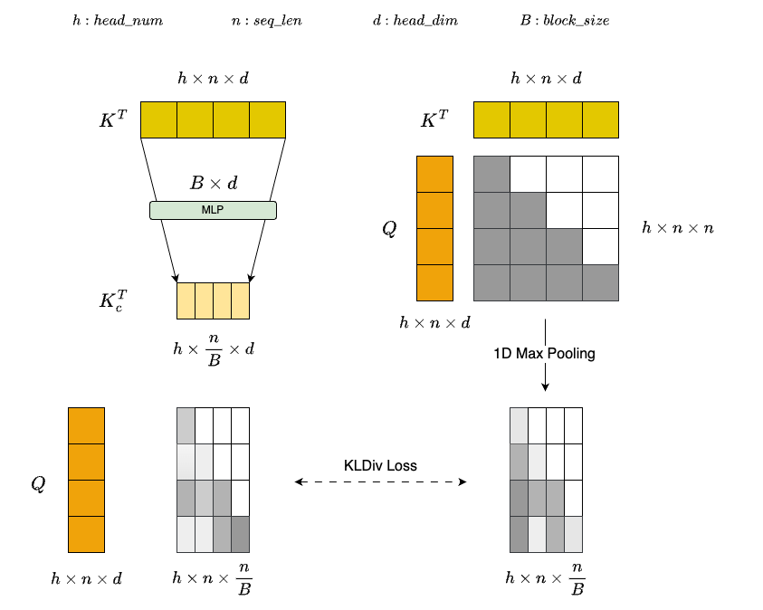
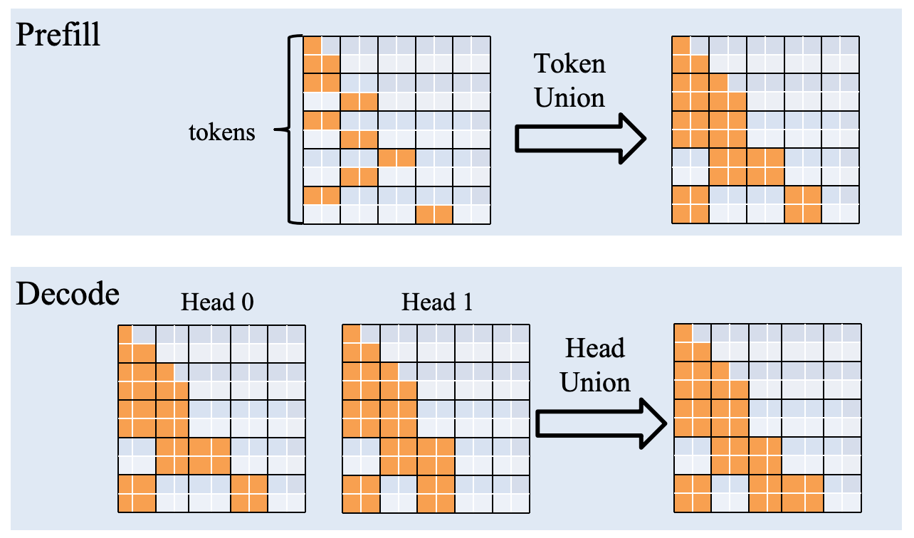

[English](../../features/plas_attention.md)

# PLAS

## 介绍

我们提出了**PLAS（Pluggable Lightweight Attention for Sparsity）**，这是对 MoBA 的改进。具体来说，我们采用了受 MoE 启发的结构，将 KV 划分为多个块，并引入了一个可学习的 MLP 层来自适应地选择重要块。PLAS 可以直接在训练后应用，此时只有 MLP 权重可学习，而原始模型权重保持不变。

与 NSA/MoBA 相比，我们的 PLAS 具有更高的可扩展性和可插拔性。它无需修改传统的注意力架构，也无需在训练前或训练后干扰模型权重训练。最终阶段只需对 MLP 层进行少量训练即可实现几乎无损的准确率。由于 NSA/MoBA 会更新整个模型权重，因此不可避免地会影响短文本的性能——即使它在输入长度小于 BlockSize × Top-K 时会自动切换到完全注意力机制。相比之下，我们的 PLAS 在短文本场景下可以实现与原始模型真正等同的完全注意力机制。

在训练效率方面，由于仅需更新 MLP 权重，训练成本极低。在推理性能方面，当输入长度为 128K、Block Size = 128、Top-K = 55 时，PLAS 相比 Flash Attention 3 实现了**386% 的加速**。

## 方法

### 训练

借鉴 NSA 和 MoBA 的方法，我们将键值对 (KV) 划分为多个块。在预填充和解码阶段，我们不再对所有键值进行注意力计算，而是动态地为每个查询 token 选择注意力得分最高的前 K 个块，从而实现高效的稀疏注意力计算。

<div align="center">

</div>

* **Attention Gate Module**: 如上图所示，为了以较低的计算开销估计每个块的重要性，我们设计了一个轻量级的注意力门模块。该模块首先通过一个MLP层压缩每个K个块，生成一个具有代表性的低维表示： $K_c^T=W_{kp}K^T$ ，其中 $W_{kp}$ 表示 MLP 层的权重。与直接应用均值池化相比，可学习的 MLP 可以更有效地捕捉不同 token 之间的语义关系和重要性分布，从而提供每个块的精细表示。在获得压缩表示 $K_c$ 之后，通过以下公式估计每个查询 token 相对于每个块的重要性：$Softmax(Q\cdot K_c^T)$。为了增强 MLP 层的判别能力，我们使用一维最大池化后的完整注意力结果 $1DMaxPooling(Softmax(Q \cdot K^T))$ 作为 ground truth。通过最小化两者之间的分布差异，引导 MLP 层学习更符合真实注意力分布的特征表示。

* **Training Data**: 得益于模型架构和训练范式的高效性，我们的方法仅使用 10 亿个 token 进行训练，便实现了近乎无损的精度。训练数据源自内部构建的包含长文本和短文本的混合语料库，从而增强了模块对不同序列长度的适应性。

* **Other**: 我们观察到，最终的解码层对模型整体准确率有显著影响。因此，在训练过程中，我们将该层排除在稀疏注意力计算之外，并在推理过程中将其恢复为完全注意力。

### 推理优化

在稀疏注意力计算过程中，每个查询 token 可能会动态选择不同的 KV 块，导致 HBM 的内存访问模式非常不规则。简单地对每个查询 token 进行单独处理是可行的，但这会导致计算粒度过细，无法充分利用张量核，从而显著降低 GPU 的计算效率。

<div align="center">

</div>

为了优化预填充和解码阶段的性能，我们设计了一种特殊的联合策略来适应各自的特点:

* **Prefill Token Union**: 我们观察到相邻的查询标记倾向于选择相似的关键块。利用这种局部性，我们取连续 128 个查询标记选择的关键块的并集，并联合计算这些标记的稀疏注意力机制。

* **Decode Head Union**: 鉴于GQA在现代模型中的广泛应用，我们发现同一组内的不同查询头经常选择重叠的关键块。因此，我们将同一组内所有查询头选择的关键块合并为一个统一的集合，并联合计算稀疏注意力机制。这种方式也减少了内存访问开销，并进一步提高了解码效率。

* **Top-K Selection**: 传统的 Top-k 算法基于排序或直接调用 Cub 库，会带来显著的运行时开销。为了缓解这个问题，我们实现了一个基于二分查找的近似 Top-k 选择算法，该算法在保持准确率的同时显著降低了延迟，最终实现了性能的显著提升。

## 评估

### 实验

我们在 LongBenchV2 和 Ruler（上下文长度分别为 32K、64K 和 128K）上评估了全注意力和稀疏注意力的精度。

<table style="border-collapse: collapse; width: 100%;">
    <tr>
        <td rowspan="4" style="border: 1px solid #dcdde0; padding: 8px; text-align: center; vertical-align: middle;">
            <strong>Model</strong>
        </td>
        <td colspan="8" style="border: 1px solid #dcdde0; padding: 8px; text-align: center; vertical-align: middle;">
            <strong>Precision</strong>
        </td>
    </tr>
    <tr>
        <td colspan="4" style="border: 1px solid #dcdde0; padding: 8px; text-align: center; vertical-align: middle;">
            <strong>FullAttention</strong>
        </td>
        <td colspan="4" style="border: 1px solid #dcdde0; padding: 8px; text-align: center; vertical-align: middle;">
            <strong>SparseAttention</strong>
        </td>
    </tr>
    <tr>
        <td rowspan="2" style="border: 1px solid #dcdde0; padding: 8px; text-align: center; vertical-align: middle;">
            <strong>LongBenchV2</strong>
        </td>
        <td colspan="3" style="border: 1px solid #dcdde0; padding: 8px; text-align: center; vertical-align: middle;">
            <strong>Ruler</strong>
        </td>
        <td rowspan="2" style="border: 1px solid #dcdde0; padding: 8px; text-align: center; vertical-align: middle;">
            <strong>LongBenchV2</strong>
        </td>
        <td colspan="3" style="border: 1px solid #dcdde0; padding: 8px; text-align: center; vertical-align: middle;">
            <strong>Ruler</strong>
        </td>
    </tr>
    <tr>
        <td style="border: 1px solid #dcdde0; padding: 8px; text-align: center; vertical-align: middle;">
            <strong>32K</strong>
        </td>
        <td style="border: 1px solid #dcdde0; padding: 8px; text-align: center; vertical-align: middle;">
            <strong>64K</strong>
        </td>
        <td style="border: 1px solid #dcdde0; padding: 8px; text-align: center; vertical-align: middle;">
            <strong>128K</strong>
        </td>
        <td style="border: 1px solid #dcdde0; padding: 8px; text-align: center; vertical-align: middle;">
            <strong>32K</strong>
        </td>
        <td style="border: 1px solid #dcdde0; padding: 8px; text-align: center; vertical-align: middle;">
            <strong>64K</strong>
        </td>
        <td style="border: 1px solid #dcdde0; padding: 8px; text-align: center; vertical-align: middle;">
            <strong>128K</strong>
        </td>
    </tr>
    <tr>
        <td style="border: 1px solid #dcdde0; padding: 8px; text-align: center; vertical-align: middle;">
            <strong>ERNIE-4.5-21B-A3B</strong>
        </td>
        <td style="border: 1px solid #dcdde0; padding: 8px; text-align: center; vertical-align: middle;">31.48</td>
        <td style="border: 1px solid #dcdde0; padding: 8px; text-align: center; vertical-align: middle;">76.74</td>
        <td style="border: 1px solid #dcdde0; padding: 8px; text-align: center; vertical-align: middle;">56.40</td>
        <td style="border: 1px solid #dcdde0; padding: 8px; text-align: center; vertical-align: middle;">25.48</td>
        <td style="border: 1px solid #dcdde0; padding: 8px; text-align: center; vertical-align: middle;">31.45</td>
        <td style="border: 1px solid #dcdde0; padding: 8px; text-align: center; vertical-align: middle;">75.93</td>
        <td style="border: 1px solid #dcdde0; padding: 8px; text-align: center; vertical-align: middle;">55.38</td>
        <td style="border: 1px solid #dcdde0; padding: 8px; text-align: center; vertical-align: middle;">25.05</td>
    </tr>
    <tr>
        <td style="border: 1px solid #dcdde0; padding: 8px; text-align: center; vertical-align: middle;">
            <strong>ERNIE-4.5-300B-A47B</strong>
        </td>
        <td style="border: 1px solid #dcdde0; padding: 8px; text-align: center; vertical-align: middle;">41.02</td>
        <td style="border: 1px solid #dcdde0; padding: 8px; text-align: center; vertical-align: middle;">94.70</td>
        <td style="border: 1px solid #dcdde0; padding: 8px; text-align: center; vertical-align: middle;">83.56</td>
        <td style="border: 1px solid #dcdde0; padding: 8px; text-align: center; vertical-align: middle;">58.18</td>
        <td style="border: 1px solid #dcdde0; padding: 8px; text-align: center; vertical-align: middle;">41.05</td>
        <td style="border: 1px solid #dcdde0; padding: 8px; text-align: center; vertical-align: middle;">94.50</td>
        <td style="border: 1px solid #dcdde0; padding: 8px; text-align: center; vertical-align: middle;">82.32</td>
        <td style="border: 1px solid #dcdde0; padding: 8px; text-align: center; vertical-align: middle;">57.85</td>
    </tr>
</table>

### 性能

我们从 InfiniteBench 中选择了一个子集 (longbook_sum_eng) 作为性能评估数据集。对于长度超过 128K 的输入，我们截断序列，保留前 64K 和后 64K 个 token。

<table style="border-collapse: collapse; width: 100%;">
    <tr>
        <td style="border: 1px solid #dcdde0; padding: 8px; text-align: center; vertical-align: middle;"></td>
        <td style="border: 1px solid #dcdde0; padding: 8px; text-align: center; vertical-align: middle;"></td>
        <td style="border: 1px solid #dcdde0; padding: 8px; text-align: center; vertical-align: middle;"><strong>QPS</strong></td>
        <td style="border: 1px solid #dcdde0; padding: 8px; text-align: center; vertical-align: middle;"><strong>Decode Speed (token/s)</strong></td>
        <td style="border: 1px solid #dcdde0; padding: 8px; text-align: center; vertical-align: middle;"><strong>Time to First token(s)</strong></td>
        <td style="border: 1px solid #dcdde0; padding: 8px; text-align: center; vertical-align: middle;"><strong>Time per Output Token(ms)</strong></td>
        <td style="border: 1px solid #dcdde0; padding: 8px; text-align: center; vertical-align: middle;"><strong>End-to-End Latency(s)</strong></td>
        <td style="border: 1px solid #dcdde0; padding: 8px; text-align: center; vertical-align: middle;"><strong>Mean Input<br>Length</strong></td>
        <td style="border: 1px solid #dcdde0; padding: 8px; text-align: center; vertical-align: middle;"><strong>Mean Output Length</strong></td>
    </tr>
    <tr>
        <td rowspan="2" style="border: 1px solid #dcdde0; padding: 8px; text-align: center; vertical-align: middle;">
            <strong>ERNIE-4.5-21B-A3B</strong>
        </td>
        <td style="border: 1px solid #dcdde0; padding: 8px; text-align: center; vertical-align: middle;">
            <strong>FullAttention</strong>
        </td>
        <td style="border: 1px solid #dcdde0; padding: 8px; text-align: center; vertical-align: middle;">0.101</td>
        <td style="border: 1px solid #dcdde0; padding: 8px; text-align: center; vertical-align: middle;">13.32</td>
        <td style="border: 1px solid #dcdde0; padding: 8px; text-align: center; vertical-align: middle;">8.082</td>
        <td style="border: 1px solid #dcdde0; padding: 8px; text-align: center; vertical-align: middle;">87.05</td>
        <td style="border: 1px solid #dcdde0; padding: 8px; text-align: center; vertical-align: middle;">61.400</td>
        <td style="border: 1px solid #dcdde0; padding: 8px; text-align: center; vertical-align: middle;">113182.32</td>
        <td style="border: 1px solid #dcdde0; padding: 8px; text-align: center; vertical-align: middle;">627.76</td>
    </tr>
    <tr>
        <td style="border: 1px solid #dcdde0; padding: 8px; text-align: center; vertical-align: middle;">
            <strong>SparseAttention</strong>
        </td>
        <td style="border: 1px solid #dcdde0; padding: 8px; text-align: center; vertical-align: middle;">0.150(+48%)</td>
        <td style="border: 1px solid #dcdde0; padding: 8px; text-align: center; vertical-align: middle;">18.12(+36%)</td>
        <td style="border: 1px solid #dcdde0; padding: 8px; text-align: center; vertical-align: middle;">5.466(-48%)</td>
        <td style="border: 1px solid #dcdde0; padding: 8px; text-align: center; vertical-align: middle;">66.35(-31%)</td>
        <td style="border: 1px solid #dcdde0; padding: 8px; text-align: center; vertical-align: middle;">42.157(-46%)</td>
        <td style="border: 1px solid #dcdde0; padding: 8px; text-align: center; vertical-align: middle;">113182.32</td>
        <td style="border: 1px solid #dcdde0; padding: 8px; text-align: center; vertical-align: middle;">590.23</td>
    </tr>
    <tr>
        <td rowspan="2" style="border: 1px solid #dcdde0; padding: 8px; text-align: center; vertical-align: middle;">
            <strong>ERNIE-4.5-300B-A47B</strong>
        </td>
        <td style="border: 1px solid #dcdde0; padding: 8px; text-align: center; vertical-align: middle;">
            <strong>FullAttention</strong>
        </td>
        <td style="border: 1px solid #dcdde0; padding: 8px; text-align: center; vertical-align: middle;">0.066</td>
        <td style="border: 1px solid #dcdde0; padding: 8px; text-align: center; vertical-align: middle;">5.07</td>
        <td style="border: 1px solid #dcdde0; padding: 8px; text-align: center; vertical-align: middle;">13.812</td>
        <td style="border: 1px solid #dcdde0; padding: 8px; text-align: center; vertical-align: middle;">206.70</td>
        <td style="border: 1px solid #dcdde0; padding: 8px; text-align: center; vertical-align: middle;">164.704</td>
        <td style="border: 1px solid #dcdde0; padding: 8px; text-align: center; vertical-align: middle;">113182.32</td>
        <td style="border: 1px solid #dcdde0; padding: 8px; text-align: center; vertical-align: middle;">725.97</td>
    </tr>
    <tr>
        <td style="border: 1px solid #dcdde0; padding: 8px; text-align: center; vertical-align: middle;">
            <strong>SparseAttention</strong>
        </td>
        <td style="border: 1px solid #dcdde0; padding: 8px; text-align: center; vertical-align: middle;">0.081(+23%)</td>
        <td style="border: 1px solid #dcdde0; padding: 8px; text-align: center; vertical-align: middle;">6.75(+33%)</td>
        <td style="border: 1px solid #dcdde0; padding: 8px; text-align: center; vertical-align: middle;">10.584(-30%)</td>
        <td style="border: 1px solid #dcdde0; padding: 8px; text-align: center; vertical-align: middle;">154.84(-34%)</td>
        <td style="border: 1px solid #dcdde0; padding: 8px; text-align: center; vertical-align: middle;">132.745(-24%)</td>
        <td style="border: 1px solid #dcdde0; padding: 8px; text-align: center; vertical-align: middle;">113182.32</td>
        <td style="border: 1px solid #dcdde0; padding: 8px; text-align: center; vertical-align: middle;">748.25</td>
    </tr>
</table>

## 使用方式

```
export FD_ATTENTION_BACKEND="PLAS_ATTN"

python -m fastdeploy.entrypoints.openai.api_server
    --model baidu/ERNIE-4.5-300B-A47B-Paddle  \
    --port 8188 \
    --tensor-parallel-size 4 \
    --quantization wint4 \
    --enable-chunked-prefill \
    --max-num-batched-tokens 8192 \
    --max-model-len 131072 \
    --max-num-seqs 32 \
    --plas-attention-config '{"plas_encoder_top_k_left": 50, "plas_encoder_top_k_right": 60, "plas_decoder_top_k_left": 100, "plas_decoder_top_k_right": 120}'
```

**Note**: 如果启用了稀疏注意力机制，系统将自动从权重目录中的`plas_attention_mlp_weight.safetensors`文件加载 MLP 权重。如果未找到 MLP 权重文件，则将对关键表示应用均值池化

**Parameter Description:**

* `FD_ATTENTION_BACKEND="PLAS_ATTN"` 启用 PLAS sparse attention.
* `plas_encoder_top_k_left=50, plas_encoder_top_k_right=60` 表示当encoder时，top-k的范围在50到60之间。
* `plas_decoder_top_k_left=100, plas_decoder_top_k_right=120` 表示当decoder时，top-k的范围在100到120之间。
