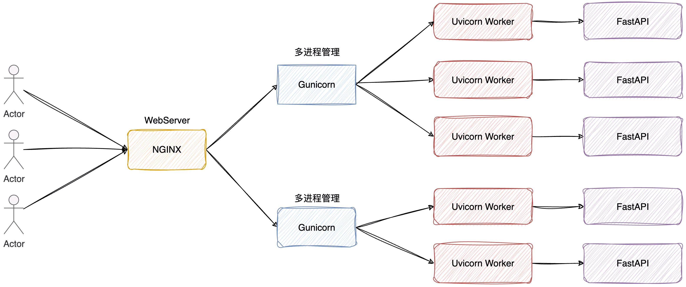

[English](../../online_serving/graceful_shutdown_service.md)

# 服务节点优雅关闭方案

## 1. 核心目标
实现服务节点的优雅关闭，确保在停止服务时不丢失任何正在处理的用户请求，同时不影响整个集群的可用性。

## 2. 实现方案说明
该方案通过结合 **Nginx 反向代理**、**Gunicorn 服务器**、**Uvicorn 服务器** 和 **FastAPI** 协作来实现目标。

## 3. 组件介绍

### 1. Nginx：流量入口与负载均衡器
- **功能**：
  - 作为反向代理，接收所有外部客户端请求并按负载均衡策略分发到上游（Upstream）的 Gunicorn 工作节点。
  - 通过健康检查机制主动监控后端节点的健康状态。
  - 通过配置管理，能够瞬时地将问题节点从服务池中摘除，实现流量切换。

### 2. Gunicorn：WSGI HTTP 服务器（进程管理器）
- **功能**：
  - 作为主进程（Master Process），负责管理多个 Uvicorn 工作子进程（Worker Process）。
  - 接收外部信号（如 `SIGTERM`），并协调所有子进程的优雅关闭流程。
  - 守护工作进程，在进程异常退出时自动重启，保证服务健壮性。

### 3. Uvicorn：ASGI 服务器（工作进程）
- **功能**：
  - 作为 Gunicorn 管理的 Worker，实际负责处理 HTTP 请求。
  - 运行 FastAPI 应用实例，处理具体的业务逻辑。
  - 实现 ASGI 协议，支持异步请求处理，高性能。

---

## 优势

1. **Nginx**：
   - 能够快速隔离故障节点，保证整体服务的可用性。
   - 通过 `nginx -s reload` 可不停机更新配置，对用户无感知。

2. **Gunicorn**（相比于 Uvicorn 原生的多 Worker）：
   - **成熟的进程管理**：内置了完善的进程生成、回收、管理逻辑，无需自己实现。
   - **进程守护能力**：Gunicorn Master 会在 Worker 异常退出后自动 fork 新 Worker，而 Uvicorn `--workers` 模式下任何进程崩溃都不会被重新拉起，需要外部守护进程。
   - **配置丰富**：提供大量参数用于调整超时、Worker 数量、重启策略等。

3. **Uvicorn**：
   - 基于 uvloop 和 httptools，速度极快。
   - 原生支持优雅关闭：在收到关闭信号后，会停止接受新连接，并等待现有请求处理完成后再退出。

---

## 优雅关闭流程

当需要下线某个特定节点时，步骤如下：

1. **Nginx 监控节点状态是否健康**：
   - 通过向节点定时发送 health 请求，监控节点的健康状态。

2. **从负载均衡中摘除**：
   - 修改 Nginx 配置，将该节点标记为 `down` 状态，并重载 Nginx 配置。
   - 此后，所有新请求将不再被发送到目标节点。

3. **Gunicorn 服务器**：
   - 监控停止信号，收到停止信号（如 `SIGTERM` 信号）时，会把此信号向所有的 Uvicorn 子进程发送。

4. **发送停止信号**：
   - 向目标节点的 Uvicorn 进程发送 `SIGTERM` 信号，触发 Uvicorn 的优雅关闭流程。

5. **等待请求处理**：
   - 等待一段稍长于 `timeout_graceful_shutdown` 的时间后强制终止服务，让该节点有充足的时间完成所有已接收请求的处理。

6. **关闭完成**：
   - 此时，该节点已经处理完所有存量请求并安全退出。
